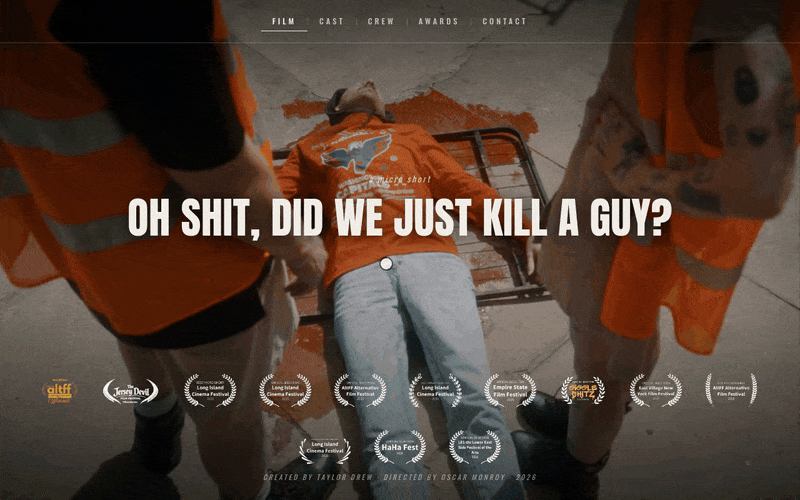

<div align="center">

# Oh Shit, Did We Just Kill a Guy?

**A poster-style promo site for an award-winning micro short, built as one static HTML file with no framework.**


**[Live site](https://micro-short-website.vercel.app)**

</div>

<p align="center">
  
  <br>
  <sub>Desktop, 1280×800, recorded in headless Chromium.</sub>
</p>

## Why I built it

*Oh Shit, Did We Just Kill a Guy?* is a 2026 micro short I created, directed by Oscar Monroy. As it started collecting festival selections, it needed one link for press and bookings that shows the film, the people behind it and the laurels. I wanted that page to feel like the film's poster, not a template, so I built it by hand.

## Highlights

- **A hash router in about 40 lines.** Five views (`#home`, `#cast`, `#crew`, `#awards`, `#contact`) are driven by `hashchange`. Every view is deep-linkable, the back button works, and the arrow keys step through views with modulo wrap-around.
- **Layout by state, not by script.** `setPage()` writes the current view to `body[data-page]`. The Awards view's entire layout (smaller title, hidden footer, laurel row turned into a 3-column grid) is plain CSS selectors on that attribute.
- **A grid that never overflows the screen.** The Awards grid uses `grid-auto-rows: minmax(0, 1fr)` with `max-height: 100%` and `object-fit: contain` on the images, so 13 laurels share a fixed canvas height instead of pushing past the viewport.
- **Cheap cross-fades.** All five stills sit in the DOM as stacked, absolutely positioned layers. Changing views only toggles an `is-active` class, and a 700 ms `opacity` transition (with `will-change: opacity`) does the rest. A gradient plus radial vignette keeps text readable on any frame.
- **Fluid type with `clamp()`.** The title, nav, laurels and spacing scale between phone and desktop with no breakpoint jumps. Fonts are Anton and Oswald from Google Fonts, with `preconnect` and `display=swap`.
- **Zero dependencies.** No framework, no build step and no third-party JavaScript. `index.html` is about 14 KB including all CSS and JS. The stills are full-resolution PNGs (the home frame alone is 5.5 MB), which is the clear next target for optimization.

## Features

- Five views in one page: Film, Cast, Crew, Awards and Contact
- A full-bleed frame from the film behind each view, cross-fading on navigation
- Keyboard navigation with the left and right arrow keys
- 13 festival laurels: a row along the bottom of every view and a full grid on the Awards view, each linking to its festival's FilmFreeway page
- Cast and crew rosters in a two-column grid that collapses to one column on small screens
- Scroll-free on every screen size: the title wraps on narrow screens and the nav scrolls sideways on phones
- Description and Open Graph tags for link previews

## Gallery

<table>
  <tr>
    <td align="center" colspan="2"><br><sub>Film</sub></td>
  </tr>
  <tr>
    <td align="center"><br><sub>Awards</sub></td>
    <td align="center"><br><sub>Cast</sub></td>
  </tr>
  <tr>
    <td align="center"><br><sub>Crew</sub></td>
    <td align="center"><br><sub>Contact</sub></td>
  </tr>
</table>

### Festival recognition

The laurel images are white on transparent backgrounds, so they are not reproduced here (they disappear on GitHub's light theme). They are visible in the demo above and on the [live site](https://micro-short-website.vercel.app/#awards).

| Festival | Recognition |
|---|---|
| AltFF Alternative Film Festival | **Winner, Best Writer** (Super Short, Spring 2026) · Best Director Nominee · Official Selection |
| Long Island Cinema Festival | **Best Micro Short** · **Best Cinematographer** · Best Micro Short Nominee · Official Selection |
| East Village New York Film Festival | Official Selection |
| Empire State Film Festival | Official Selection |
| The Jersey Devil Film Festival | Official Selection |
| Giggle Shitz Film Festival | Official Selection |
| HaHa Fest | Official Selection |
| LES: the Lower East Side Festival of the Arts | Official Selection |

## How it's built

Everything lives in `index.html`: a `<style>` block, a fixed markup shell (stage, nav, centered title, laurel row, footer) and a short `<script>` that fills the shell from data.

- **Content is data.** Page text, rosters and laurels are defined in two plain objects, `PAGE_DATA` and `LAURELS`, and rendered into one shared layout. Adding a festival is one array entry and one image. *Why:* the laurel list kept growing during the festival run, and this keeps each update to a one-line change.
- **One title, five views.** The `<h1>` never changes; only the eyebrow, subtitle and content slot swap. *Why:* the film's name is the brand, and keeping it fixed makes the site read like a single poster rather than five pages.
- **Hash routing instead of separate pages.** *Why:* it gives deep links and back-button support with no server config, and the stills stay loaded between views so the fades are smooth.
- **Design tokens for color.** One warm white (`#f3efe7`) plus dimmed and rule variants, held in CSS custom properties on `:root`. *Why:* the stills supply all the color; the UI stays in one neutral tone on black.

## Tech

| Layer | Choice |
|---|---|
| Markup | Semantic HTML (`nav`, `main`, `h1`) |
| Styling | Hand-written CSS: custom properties, Flexbox, Grid, `clamp()` |
| Behavior | Vanilla JavaScript, no dependencies |
| Type | Anton (display) and Oswald (UI) via Google Fonts |
| Hosting | Vercel, static |

```
.
├── index.html                          # The production site
├── Oh Shit Did We Just Kill A Guy.html # Original design prototype
├── stills/                             # Five full-bleed background frames, one per view
├── laurels/                            # 13 festival laurels (transparent PNGs)
└── docs/media/                         # README demo GIF
```

## Run locally

There is nothing to install or build. Open `index.html` in a browser, or serve the folder:

```bash
git clone https://github.com/taylordrew4u2/micro-short-website.git
cd micro-short-website
python3 -m http.server 8000
# visit http://localhost:8000
```

## Deploy

The site is deployed on Vercel as a static site. `index.html` sits at the repository root, so it needs no build command and no configuration. Import the repo into Vercel and deploy.

## Credits

**Created by** Taylor Drew · **Directed by** Oscar Monroy · **Director of Photography** Mike Cerisano · **Costume Design** Taylor Drew · **Asst. Camera & Grip** Miguel Dusauzay · **Music** Jared Bailey

**Cast:** Taylor Drew (starring), Adiel Kay (starring), Evan Kash (featuring)

**Press and bookings:** [filmfreeway.com/TaylorDrew](https://filmfreeway.com/TaylorDrew)

No license file is included. The film stills and festival laurels belong to their respective owners and are not licensed for reuse.

---

<p align="center">Built by Taylor Drew · <a href="https://github.com/taylordrew4u2">github.com/taylordrew4u2</a></p>
