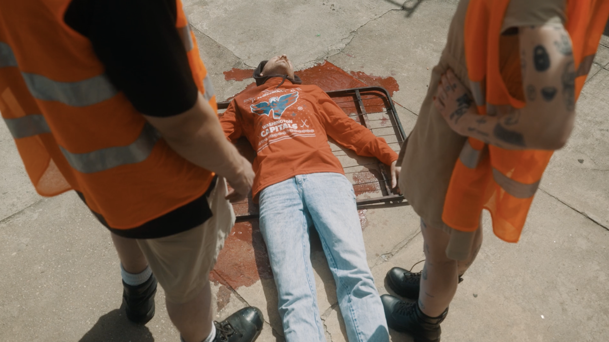
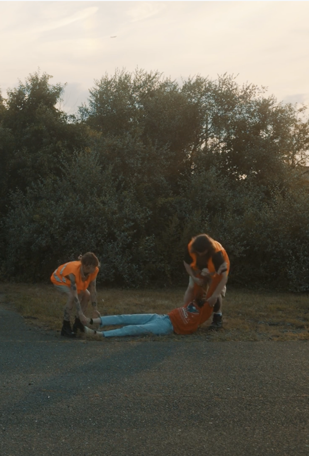
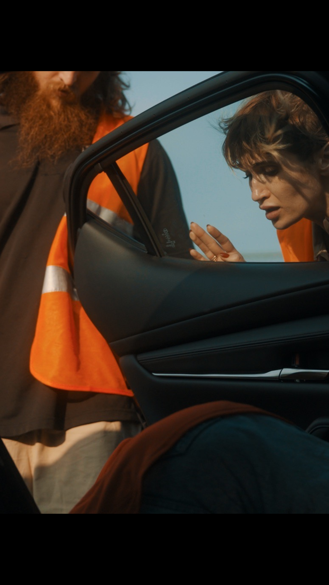
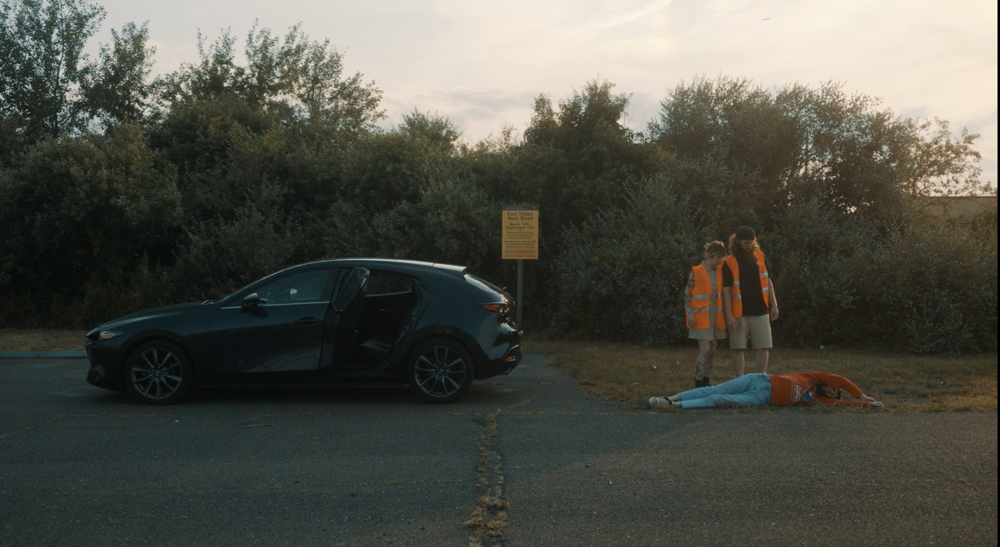
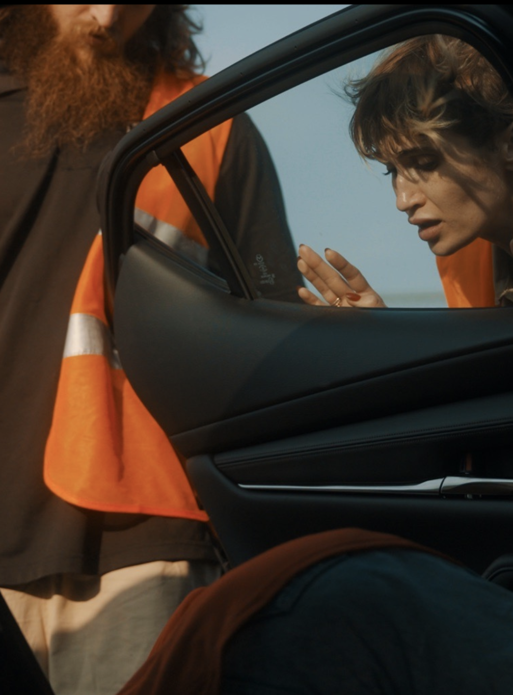

# Oh Shit, Did We Just Kill a Guy?

**A cinematic, zero-dependency promotional site for an award-winning micro short film.**

**Live site:** [micro-short-website.vercel.app](https://micro-short-website.vercel.app)



## Overview

The official website for *Oh Shit, Did We Just Kill a Guy?*, a micro short created by Taylor Drew and directed by Oscar Monroy (2026). The site presents the film the way a poster would: one full-bleed frame from the film per page, a single bold title, and the festival laurels the film has earned.

It is a single static HTML file with five hash-routed views (Film, Cast, Crew, Awards and Contact), built in plain HTML, CSS and JavaScript.

## Features

- **Five views, one page.** `#home`, `#cast`, `#crew`, `#awards` and `#contact` are driven by the `hashchange` event. Every view is deep-linkable and works with the browser's back button.
- **Cross-fading film stills.** Each view has its own background frame. The frames fade in and out over 700 ms, under a gradient and radial vignette that keeps the text readable on any shot.
- **Keyboard navigation.** The left and right arrow keys move through the views in order, wrapping at either end.
- **Festival laurels.** 13 laurels with transparent backgrounds. They sit in a row along the bottom of every view and fill a 3-column grid on the Awards view. Each one links to its festival's FilmFreeway page.
- **Cast and crew rosters.** Role and name pairs in a two-column grid that drops to one column on small screens.
- **Responsive and scroll-free.** Each view fits the viewport exactly. The title wraps to two lines on narrow screens, and the nav scrolls horizontally on phones.
- **Share-ready metadata.** A description and Open Graph tags for link previews.

## Gallery

| Cast | Crew |
|:---:|:---:|
|  |  |
| **Awards** | **Contact** |
|  |  |

## Festival Recognition

| Festival | Recognition |
|---|---|
| AltFF Alternative Film Festival | **Winner, Best Writer** (Super Short, Spring 2026) · Best Director Nominee · Official Selection |
| Long Island Cinema Festival | **Best Micro Short** · **Best Cinematographer** · Best Micro Short Nominee · Official Selection |
| East Village New York Film Festival | Official Selection |
| Empire State Film Festival | Official Selection |
| The Jersey Devil Film Festival | Official Selection |
| Giggle Shitz Film Festival | Official Selection |
| HaHa Fest | Official Selection |
| LES: the Lower East Side Festival of the Arts | Official Selection |

## Tech Stack

- **HTML, CSS, vanilla JavaScript.** No framework, no build step and no third-party JS.
- **Google Fonts:** Anton for the display title and Oswald for everything else.
- **Vercel** for static hosting. `index.html` is served at the root URL.

## Engineering and Design Notes

- **Data-driven content.** The page text, rosters and laurels are defined in two plain objects (`PAGE_DATA` and `LAURELS`) and rendered into a single shared layout. To add a festival laurel, add one array entry and one image.
- **Styling by page state.** The current view is written to `body[data-page]`, so each view's layout lives in CSS rather than in JavaScript. The Awards view uses this to shrink the title and turn the laurel row into a grid.
- **A laurel grid that fits the screen.** The Awards grid uses `grid-auto-rows: minmax(0, 1fr)`, so its rows share a fixed height instead of growing past the bottom of the screen.
- **Fluid type.** `clamp()` sizes the title, nav, laurels and spacing between phone and desktop widths.
- **Design tokens.** The colors are a warm white (`#f3efe7`) plus dimmed and rule variants, all held in CSS custom properties.
- **Accessible defaults.** The nav has a label, decorative layers are `aria-hidden`, every laurel has descriptive alt text, laurel images load lazily, and external links open in a new tab with `rel="noopener"`.

## Project Structure

```
.
├── index.html                          # The production site
├── Oh Shit Did We Just Kill A Guy.html # Original design prototype
├── stills/                             # Five full-bleed background frames, one per view
└── laurels/                            # 13 festival laurels (transparent PNGs)
```

## Running Locally

There is nothing to install or build. Open `index.html` in a browser, or serve the folder:

```bash
git clone https://github.com/taylordrew4u2/micro-short-website.git
cd micro-short-website
python3 -m http.server 8000
# then visit http://localhost:8000
```

## Deployment

The site is deployed on Vercel as a static site. Because `index.html` sits at the repository root, it needs no configuration.

## Credits

**Created by** Taylor Drew · **Directed by** Oscar Monroy · **Director of Photography** Mike Cerisano · **Costume Design** Taylor Drew · **Asst. Camera & Grip** Miguel Dusauzay · **Music** Jared Bailey

**Cast:** Taylor Drew, Adiel Kay, Evan Kash

**Press and bookings:** [filmfreeway.com/TaylorDrew](https://filmfreeway.com/TaylorDrew)

## License

No license file is included. The film stills and festival laurels belong to their respective owners and are not licensed for reuse.
